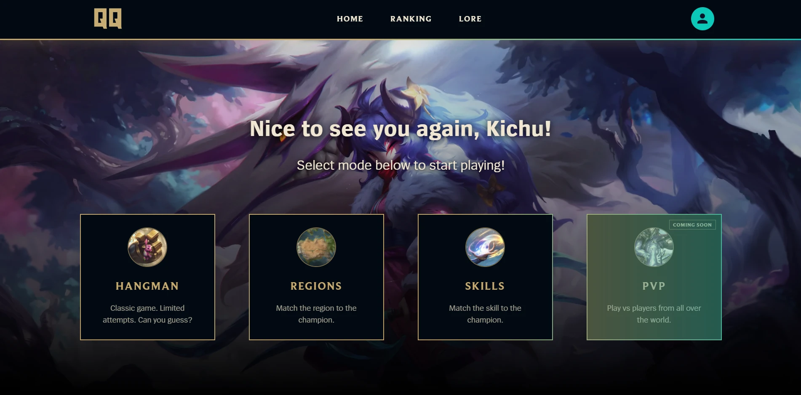
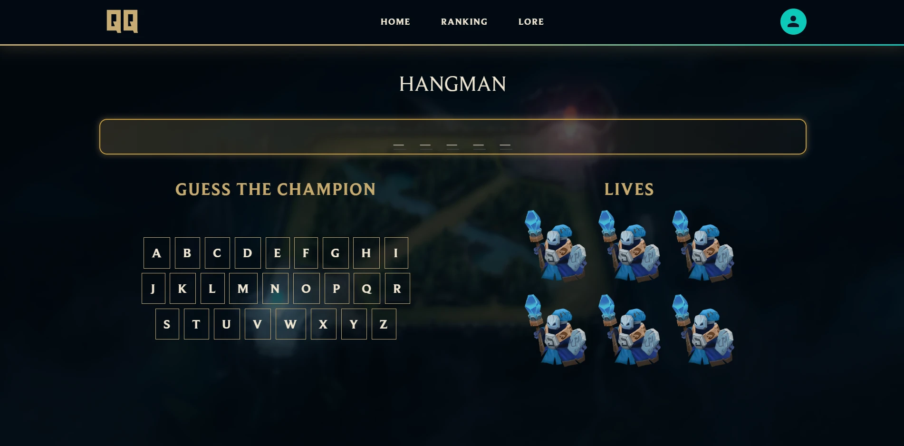
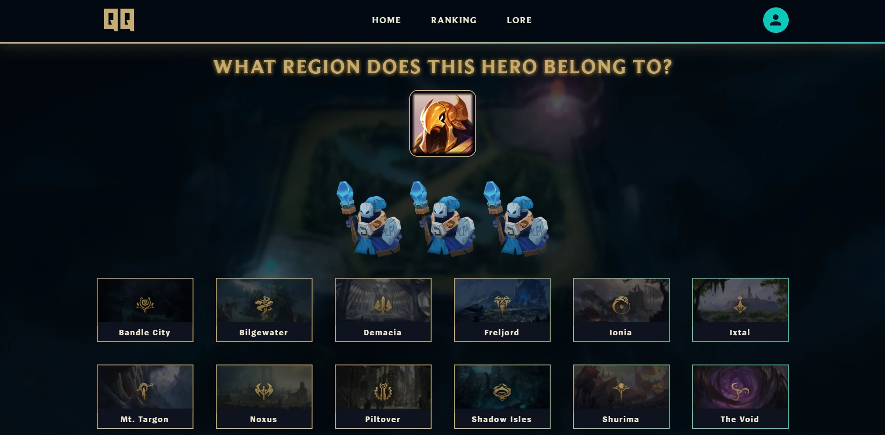
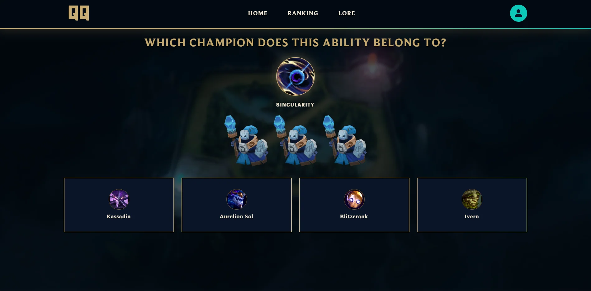
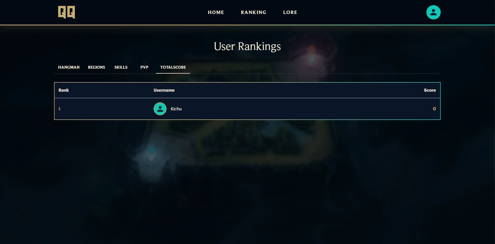
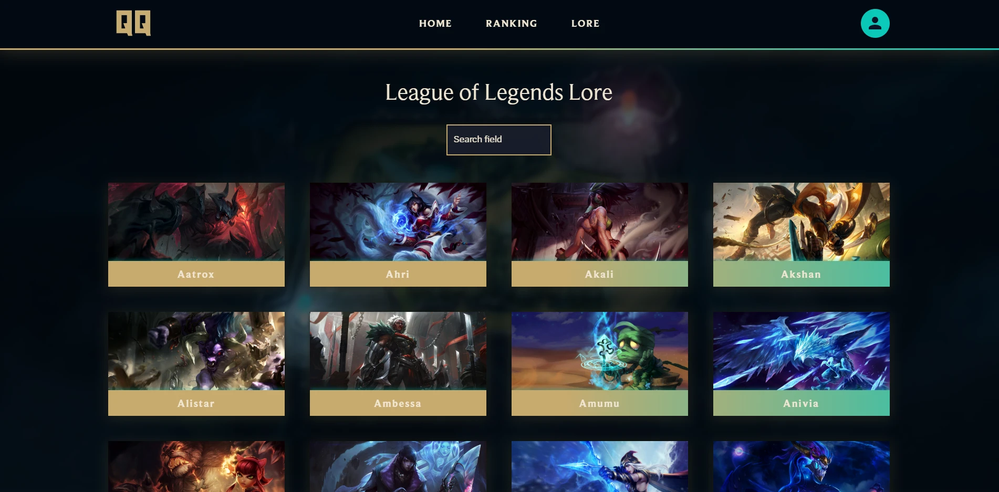
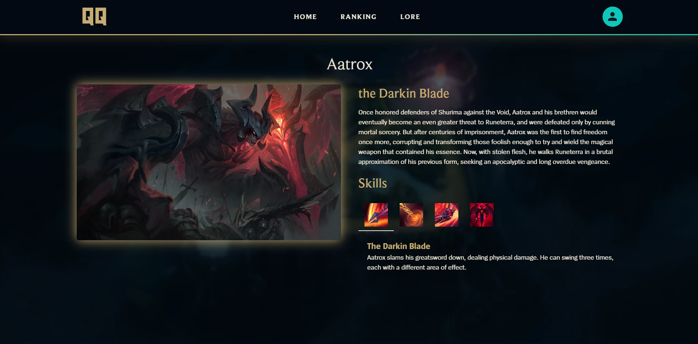
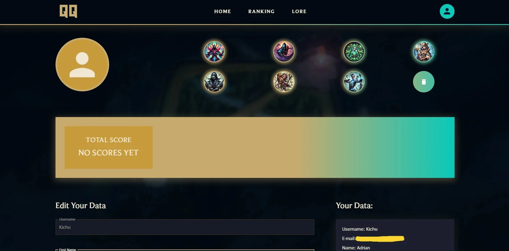
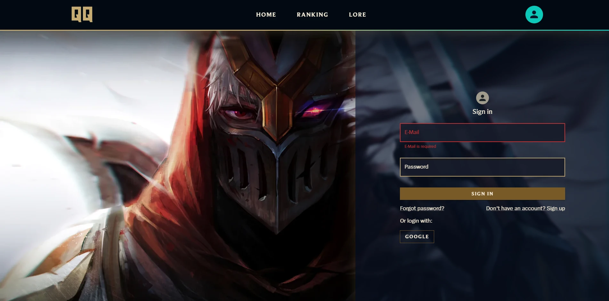

# Quiz-LoL

[](https://github.com/Kiczu/quiz-lol/actions/workflows/ci.yml)

A League of Legends quiz app: three playable game modes, user accounts, a leaderboard
and a champion browser. Champion data comes from Riot's Data Dragon; everything that
decides whether an answer is correct runs on the server, not in the browser.

Built as a portfolio project, with a custom League-inspired UI.



## Demo

Not deployed yet.

## Game modes

| Mode | You see | You answer with | Scoring | Lives |
|---|---|---|---|---|
| **Hangman** | a masked champion name | one letter at a time | 1 per revealed letter, +10 for solving | 6 |
| **Regions** | a champion portrait | one of the 13 regions of Runeterra | 10 / 6 / 3 by wrong guesses | 3 |
| **Skills** | an ability icon and name | one of four champions | 10 / 6 / 3 by wrong guesses | 3 |

| Hangman | Regions | Skills |
|---|---|---|
|  |  |  |

## Features

- Sign in with email and password or with Google, password reset, email verification
- User dashboard: avatar, profile details, password change, per-mode scores, account deletion
- Leaderboard per game mode and by total score
- Champion browser with search, and a detail page per champion with abilities and splash art

## Screenshots

| Leaderboard | Champion browser |
|---|---|
|  |  |

| Champion detail | User dashboard |
|---|---|
|  |  |

| Sign in | |
|---|---|
|  | |

## Architecture

The app is two deployables in one repository.

`src/` is the React client. `functions/` is a separate Node project deployed to Cloud
Functions, and it owns every decision that affects a score:

- `startRound` picks the champion, builds the question and stores the answer in a
  `secret` subdocument. The client receives the question only - never the answer.
- `submitGuess` checks the guess against that subdocument, counts the wrong guesses,
  decides when the round is over and writes the score with the admin SDK.

`firestore.rules` closes the `rounds` collection to every client and freezes `totalScore`
and `scores` on the public profile, so a player can edit their username and avatar but
cannot write their own points. The browser holds no answer and awards no points, which
means the leaderboard cannot be forged from the developer console.

## Tech stack

- **React 18 + TypeScript**, **Vite** as the build tool
- **Material-UI** with a custom League-inspired theme, **framer-motion** for animation
- **React Router**, **Formik** and **Yup** for forms and validation
- **Firebase**: Authentication, Firestore, Cloud Functions (Node 22, TypeScript)
- **Vitest** and **Testing Library** for tests, **ESLint** for linting
- **GitHub Actions** running lint, tests and both builds on every push

## Getting started

The repository is wired to one Firebase project, so a fresh clone needs its own:

1. Create a Firebase project and enable Authentication, Firestore and Cloud Functions
   (Cloud Functions require the Blaze plan).
2. Replace the values in `src/api/firebase/firebaseConfig.ts` with your own web config.
3. Put your project id in `.firebaserc`.
4. Install dependencies and start the dev server:

```
npm install
npm run dev
```

To deploy the backend:

```
firebase deploy --only functions,firestore:rules
```

## Local development with the Firebase emulators

The game modes run on Cloud Functions, so the app needs a backend even in development.
The emulator suite provides one locally, with its own database and its own user accounts,
so nothing you do while developing touches production.

One-time setup:

- `npm install -g firebase-tools`
- a JDK 11 or newer on the PATH (the Firestore and Auth emulators are Java)

Then:

```
npm run emulators
```

That builds `functions/`, starts Auth, Firestore and Functions, and puts the emulator UI
on http://127.0.0.1:4000. On the first run it seeds the `championRegions` collection from
the live project, which the Regions mode needs in order to pick a champion. On exit it
writes the whole local state - including the accounts you registered - to
`.emulator-data`, and imports it again next time, so you only register once. Use
`npm run seed:emulator` if you ever need to refresh that collection by hand.

`npm run dev` connects to the emulators automatically. Register an account through the app
the first time; it lives only in the emulator. To run the dev server against the live
project instead, put `VITE_USE_EMULATORS=false` in `.env.local`.

## Scripts

| Command | What it does |
|---|---|
| `npm run dev` | Vite dev server |
| `npm run build` | type-check and build the client |
| `npm run test` / `npm run test:run` | Vitest, watch mode / single run |
| `npm run lint` / `npm run lint:fix` | ESLint |
| `npm run emulators` | build `functions/` and start the emulator suite |
| `npm run seed:emulator` | copy `championRegions` into a running emulator |
| `npm run images` | optimise images in `src/assets` |

## Roadmap

- **PVP mode** - the one game mode still missing, and the reason the round logic moved
  to the server first
- In-app notifications after actions
- Achievements and seasonal challenges
- Accessibility pass

## Author

Built by [Kiczu](https://github.com/Kiczu).
